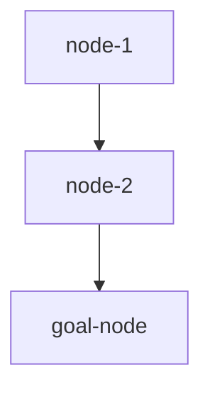

# Dependency Graph — REPLACE_ME

> 状态：`locked | ready | learning | ok | mastered | deferred`

| id | name | status | prereq | check_method |
|----|------|--------|--------|--------------|
| n1 | | ready | | short answer |
| n2 | | locked | n1 | quiz |
| n3 | | locked | n2 | transfer |
