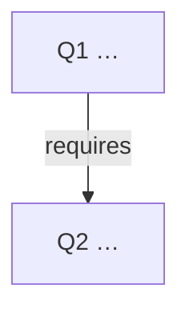

# 问题图 · {{TOPIC}}

goal_layer: operate  
入口：本图 · [wiki/index](wiki/index.md) · [wiki/log](wiki/log.md)

## 节点表

| ID | 问题 | 类型 | 成功标准 | 状态 | wiki |
|----|------|------|----------|------|------|
| Q1 | | practice | | open | |
